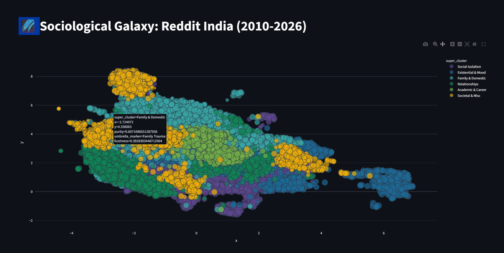

# 🌌 Tracking the Semantic Shift



### A Sociological Galaxy of Indian Mental-Health Discourse on Reddit (2010 – 2026)

**17,000+ Reddit posts** · **49 umbrella markers** · **6 super-clusters** · **Fuzzy membership for every post**

*Mapping the invisible geography of distress — one dot at a time.*

---

## 📋 Table of Contents

- [Overview](#-overview)
- [Pipeline Architecture](#-pipeline-architecture)
- [Interactive Explorer](#-interactive-explorer)
- [Linguistic Marker Analysis](#-linguistic-marker-analysis)
- [Dataset Schema](#-dataset-schema)
- [Quickstart](#-quickstart)
- [Tech Stack](#-tech-stack)

---

## 🔭 Overview

> *"Depression doesn't speak in clean categories — it bleeds across stressors."*

This project constructs a **Sociological Galaxy Map** — an interactive 2D scatter-plot where each dot is a Reddit post from an Indian user describing some form of psychological distress. Posts are not forced into rigid boxes; instead, every post carries a **fuzzy membership vector** across six super-clusters (e.g., *Relationships*, *Academic & Career*, *Family & Domestic*), allowing us to see the *bleeding* between different forms of distress.

**The core question:**

> **What are the dominant, culturally specific stressors expressed by Indians online, and how do they overlap?**

---

## 🏗 Pipeline Architecture

The end-to-end pipeline transforms raw Reddit text into the final galaxy visualization through **six stages**:

```
📄 Raw Posts ──▶ 🔢 Embeddings ──▶ 📉 UMAP ──▶ 🧩 BERTopic ──▶ 🌀 FCM ──▶ 🏷️ Gemma-2 ──▶ 🌌 Galaxy
 (17,000+)       (1024-D)        (10D + 2D)   (Hard Clusters)  (Fuzzy)   (Labeling)     (Plotly)
```

---

### 1. Dual-Track Dimensionality Reduction

The process begins by reducing **1024-dimensional** text embeddings using **UMAP**, split into two parallel tracks:

| Track | Target Dims | Purpose |
|:------|:-----------:|:--------|
| **Clustering** | 10-D | Preserves enough mathematical structure for accurate downstream clustering |
| **Visualization** | 2-D (`x`, `y`) | Produces the spatial coordinates for rendering the galaxy map |

> **💡 Why two tracks?** Reducing directly to 2-D for clustering would destroy too much information. The dual-track approach lets us cluster in a richer space while still getting a beautiful 2-D layout.

---

### 2. Topic Discovery (Hard Clustering)

Initial theme discovery is performed with **BERTopic**:

- **HDBSCAN** identifies dense *hard* clusters — each post belongs to exactly one topic at this stage
- **Custom Vectorization** filters out Hindi and English stop words (noise) and surfaces meaningful **bigrams** like `"financial stress"` or `"parental pressure"`

```
"I can't handle the academic pressure anymore, my parents keep comparing me..."
                           └──────────┘              └────────────┘
                           bigram detected            bigram detected
```

---

### 3. Fuzzy C-Means (FCM) Refinement

Because real-world distress doesn't fit neatly into one box, the hard clusters are refined using **Fuzzy C-Means**:

- **Warm-Start** — The centroids (mathematical centers) discovered by BERTopic are used as the starting point, so FCM converges faster and more meaningfully
- **Membership Matrix** — Every post receives a probability score (0.0 → 1.0) for *every* cluster

```
Post #4521: "My parents are forcing me into engineering but I just failed my exams..."

  Academic & Career  ████████████████░░░░  0.62
  Family & Domestic  ████████████░░░░░░░░  0.31
  Societal & Misc    ██░░░░░░░░░░░░░░░░░░  0.05
  Relationships      █░░░░░░░░░░░░░░░░░░░  0.02
```

> **⚡ Key Innovation** — A post about parental pressure over academics lives *between* clusters, not arbitrarily in one.

---

### 4. Zero-Shot Sociological Labeling

The abstract cluster IDs are translated into **human-readable sociological titles** using **Gemma-2-2B-IT**:

- The model analyzes the **top keywords** and **representative documents** for each cluster
- It generates concise **1–3 word umbrella markers**

| Cluster ID | Top Keywords | Gemma Label |
|:----------:|:-------------|:------------|
| 7 | exam, marks, cgpa, semester, fail | **Academic Pressure** |
| 12 | parents, family, home, abuse, toxic | **Family Trauma** |
| 23 | lonely, friends, no one, isolated | **Social Isolation** |

---

### 5. Taxonomy & Aggregation

The 49 specific umbrella markers are grouped into broader **Super-Clusters** to make the visualization interpretable:

```
Super-Cluster: "Family & Domestic"
├── Parental Pressure
├── Family Trauma
├── Domestic Abuse
└── Arranged Marriage Stress

Super-Cluster: "Academic & Career"
├── Academic Pressure
├── Career Anxiety
├── Unemployment
└── Competitive Exam Stress
```

- **Aggregation** — Fuzzy probabilities of related sub-clusters are summed into a single super-cluster score
- **Purity** — Calculated as `1 − fuzziness` (inverse of entropy). High purity = the model is *confident* about this post's classification

---

### 6. Final Galaxy Rendering

The visualization is rendered using **Plotly Express**, mapping 17,000+ posts onto the 2-D UMAP coordinates:

| Visual Property | Maps To | Interpretation |
|:----------------|:--------|:---------------|
| 🎨 **Color** | Super-Cluster | Which broad category of distress (Relationships, Financial, Domestic, etc.) |
| 📏 **Size** | Purity | Large, bright dots = "pure" examples; small, faint dots = ambiguous / hybrid posts |

> **💡 Tip:** Look for the **large, bright stars** — they are the clearest expressions of a single stressor. The tiny, faint dots in *between* clusters are the most interesting: they represent **hybrid distress** that defies simple categorization.

---

## 🖥 Interactive Explorer

The project includes a **Streamlit** application (`app.py`) that lets you explore the galaxy interactively:

| Feature | Description |
|:--------|:------------|
| 🌌 **Galaxy Map** | Full interactive scatter plot — zoom, pan, hover for details |
| 🔍 **Fuzzy Membership Audit** | Click any dot (or enter an index) to inspect its full probability vector via a **radar chart** |
| 🎚 **Fuzziness Filter** | Slide the threshold to filter out vague/hybrid posts and focus on "pure" examples |
| 🏷 **Stressor Filter** | Toggle super-clusters on/off to isolate specific regions of the galaxy |
| 🧠 **Linguistic Markers** | Real-time NLP analysis of the selected post (see below) |
| 📊 **Data Table** | Browse the raw data behind the visualization |

---

## 🧠 Linguistic Marker Analysis

Each selected post is analyzed in real-time for clinically validated linguistic markers:

| Marker | Based On | What It Measures |
|:-------|:---------|:-----------------|
| **Absolutist Thinking** | Al-Mosaiwi & Johnstone (2018) | Frequency of words like *"never"*, *"always"*, *"nothing"* — indicators of all-or-nothing cognitive distortion |
| **Negative Self-Reference** | Pennebaker (1997) | Words like *"failure"*, *"worthless"*, *"burden"* — strength of negative self-concept |
| **Cognitive Distress Score** | ATQ Literature | Combined weighted score from absolutism + negative self-reference (0.0 – 1.0) |
| **Attribution Style** | Pronoun Analysis | Ratio of first-person (`I`, `me`, `my`) to external references (`they`, `parents`, `society`) — internal vs. external attribution of distress |
| **Resilience Signals** | Positive Self-Words | Detects words like *"healing"*, *"recovering"*, *"growing"* as counter-indicators |

> Minimum 20 words required for reliable analysis. Flagged words are highlighted as color-coded pills in the sidebar.

---

## 📊 Dataset Schema

The processed dataset (`distress_final_reduced.csv`) contains **17,398 posts** with the following columns:

| Column | Type | Description |
|:-------|:-----|:------------|
| `created_utc` | int | Unix timestamp of post creation |
| `full_text` | str | Complete post text (title + body) |
| `date` | datetime | Human-readable date |
| `x`, `y` | float | 2-D UMAP coordinates for visualization |
| `primary_cluster` | str | Dominant umbrella marker |
| `fuzziness` | float | Entropy of the membership vector (0 = pure, 1 = maximally ambiguous) |
| `super_cluster` | str | Broad category label |
| `umbrella_marker` | str | Specific sociological label from Gemma |
| `purity` | float | `1 − fuzziness` — confidence score |
| `prob_*` | float | Fuzzy membership probabilities for each super-cluster |

**Super-Cluster probability columns:**

```
prob_social_isolation    prob_relationships       prob_existential_&_mood
prob_societal_&_misc     prob_academic_&_career   prob_family_&_domestic
```

---

## 🚀 Quickstart

**Prerequisites:** Python 3.12+ and [uv](https://docs.astral.sh/uv/) (recommended) or pip

```bash
# Clone the repository
git clone https://github.com/<your-username>/tracking_the_semantic_shift.git
cd tracking_the_semantic_shift

# Install dependencies (using uv)
uv sync

# Launch the galaxy explorer
uv run streamlit run app.py
```

The app will open at `http://localhost:8501`.

**Alternative (pip):**

```bash
pip install streamlit pandas plotly
streamlit run app.py
```

---

## 🛠 Tech Stack

| Category | Tools |
|:---------|:------|
| Embeddings | 1024-D text embeddings (pre-computed) |
| Dim. Reduction | UMAP (10-D clustering + 2-D visualization) |
| Hard Clustering | BERTopic + HDBSCAN + custom vectorizer |
| Soft Clustering | Fuzzy C-Means (warm-started from BERTopic centroids) |
| Labeling | Gemma-2-2B-IT (zero-shot sociological titles) |
| Visualization | Plotly Express (WebGL) + Streamlit |
| NLP Analysis | Custom linguistic markers (Al-Mosaiwi methodology) |
| Package Mgmt | uv + pyproject.toml |

---

## 📁 Project Structure

```
tracking_the_semantic_shift/
├── app.py                          # Streamlit interactive explorer
├── markers-implementation.ipynb    # Pipeline notebook (UMAP → BERTopic → FCM → Gemma)
├── distress_final_reduced.csv      # Processed dataset (17,398 posts)
├── pyproject.toml                  # Project configuration
├── assets/
│   └── galaxy_banner.png           # README banner
└── readme.md                       # You are here
```

---

## 📜 License

This project is for **academic and research purposes**. All Reddit data was collected from public subreddits and anonymized. No personally identifiable information is included.

---

*Built with curiosity, caffeine, and a deep belief that data can illuminate the human condition.*

**⭐ Star this repo if you found it useful!**
